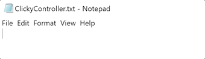

# ClickyController

## A C# library for controlling mouse and keyboard input on Windows through code, which is being made as part of my uni dissertation work.

### The GUI is currently a work in progress, however the library itself works.

